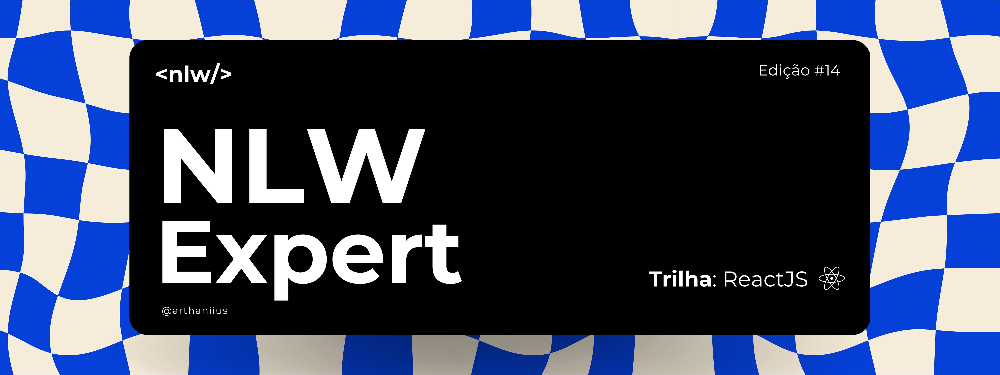
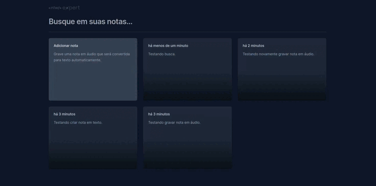

# NLW Expert (React)



## :rocket: Sobre o projeto

Essa aplicação foi desenvolvida durante o NLW Experts da Rocketseat utilizando:

- React
- TypeScript
- Radix UI
- Tailwind
- SpeechRecognition API

Ela permite criar notas em texto, gravar notas em áudio automaticamente convertidas em texto, além de possibilitar a exclusão e a pesquisa de notas por palavras-chave.

## :running: Executando

Após clonar o repositório, acesse a pasta do projeto e execute os comandos abaixo:

```sh
npm install
npm run dev
```

Acesse http://localhost:5173 para visualizar a aplicação.

## :computer: Demonstração


